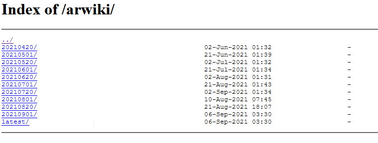

# توليد قائمة كلمات عربية
# Arabic Wordlist Generator
Python program to generate a wordlist in Arabic
بسم الله الرحمن الرحيم

 


 # مقدمة

في هذا المشروع سوف استخدم لغة البايثون وهي أسهل لغة تعلمتها على الاطلاق واقوى لغة استخدمتها خاصة في المشاريع من هذا النوع والتي لا تحتوى على واجهة رسومية. سوف أحاول بقدر المستطاع استخدام البايثون بدون مكتبات قدر الإمكان وسوف استخدم وثائق اللغة Documentation  كمرجع أساسي لبحثي عن أي دالة او طريقة برمجية ويمكن الوصل الى توثيق لغة بايثون من خلال موقعهم الرسمي ولا مانع بالاستعانة ببحث قوقل والمواقع الكبرى ك Stackoverflow.com عموما تجدون التوثيق على الرابط https://docs.python.org/3/contents.html

## إنشاء قائمة كلمات خاصة

لدي العديد من الأفكار والتي تتطلب وجود بيانات على الأخص قائمة الكلمات او ما يسمى Wordlist طبعا يوجد العديد من المصادر التي تستطيع الحصول منها على قائمة كلمات جاهزة، ولكن اين المتعة في ذلك. اريد صنع قائمة الكلمات الخاصة بي لعدة أسباب وهي :

* الأول والأهم هو أنى اريد ان اعرف كيف اصنع قائمة كلمات خاصة بي.
* أريد ان أتأكد ان قائمة الكلمات نظيفة ومرتبة ولا تحتوي على أخطاء لأنني سوف استخدمها لاحقا في عدة تطبيقات مثل المصحح الاملائي و الملخص (سوف اتحدث عنهما لاحقاً)
* اريد لهذه القائمة ان تصبح مصدر مفتوح لكل من يرغب في استخدامها
* اغلب القواسم الموجودة هي قوائم صنعها غير العرب لأغراض بحثية لذا قائمتي ستكون عربية خالصة.

طبعا أول خطوة لصنع قائمة كلمات هي البحث عن مصدر لنصوص عربية كثيرة ومدققة على الأقل إملائيا. يوجد العديد من المصادر للنصوص العربية وهنا ايضاً لا أريد ان احصل على نصوص معدة مسبقا. لذلك فكرت في استخدام النصوص الموجودة في ويكيبيديا العربية. طبعا نستطيع كتابة برنامج او برمجية صغيرة لتصفح ويكيبيديا العربية و القيام بعملية تسمى تجريف الويب او web Scrapping  ( من الممكن التطرق لها لاحقاً لأنها مهمة في صناعة محركات البحث مثل قوقل ومايكروسوفت بنج وغيرها). وللتسهيل يوجد خدمة مقدمة من ويكيبيديا تسمح لك بنزيل هذه المحتويات دفعة واحدة بدل من عناء تجريفها باستخدام برمجية من خلال موقع  ويكيبيديا دمبز Wikipedia Dumps  ورابط الموقع هو https://dumps.wikimedia.org/enwiki/.

كل ما علينا تغيير الصفحة للعربية بتغيير enwiki الى arwiki  سوف تظهر هذه الصفحة وفيها العديد من النسخ dumps بحسب التاريخ سوف اختار أي منها فلا يهمني تاريخ التحديث لأني اريد بيانات خام ولست مهتما بالبيانات نفسها ولا حتى مدى دقتها بعد الضغط على احد المجلدات التي تحمل التواريخ وليكن 20210420

سوف تظهر لنا صفحة فيها العديد من الروابط


لغرض تكوين قائمة كلمات سوف استبعد الرابط الأول بسبب حجمه (قرابة 1.5 جيجا من البيانات) وبدلا عنهما سوف اختار ثاني رابط يحمل pages-articles  والذي حجمه 1 ميجا تقريبا  يوجد ملفات xml وملفات txt سوف اختار احد الملفات بامتداد txt . تجدر الإشارة هنا ان هذا الملف يحتوي على عنواين المقالات فقط وليس نصوصها واعتقد أنه يكفي لمثل استخدامنا هنا.


https://dumps.wikimedia.org/arwiki/20210420/arwiki-20210420-pages-articles-multistream-index1.txt-p1p340838.bz2

بعد تنزيل هذا الملف نستطيع فتحه عن طريق برنامج winrar ولكن سوف يكون لدينا ملف بلا امتداد وهو عبارة عن ملف نصي سوف نفتحه في برنامج notepad++ أو visual studio code  .

 

 وهذه لمحة من محتويات الملف
 

الان سوف نبدأ العمل

البيانات متسخة Dirty وتحتاج الى تنظيف ويوجد قواعد لتنظيف البيانات الخام تنطبق على البيانات باللغة الإنجليزية لن اتطرق لها ولكن سوف أحاول إيجاد آلية لتنظيف نصوص عربية

هيا لبدأ سويا بالتفكير فيما يجب اتخاذه حيال هذه الكلمات

نقوم بحفظ الملف المستخرج من الملف المضغوط بامتداد txt وليكن rawdata.txt
يجب تحميل كل البيانات الخام كنص واحد ليتم معالجته. هنا سوف نستدعي دالة فتح ملف من لغة البايثون

سوف افتح الملف باستخدام ترميز utf-8 لتلافي مشاكل الترميز لاحقا

```python
data = open("rawdata.txt","r",encoding="utf-8")

print(data.read(1000)) # للتأكد من البيانات سيتم طباعة اول 100 حرف (قد تأخذ طباعة كامل النص وقت طويل) 
```

    
نحفظ النص في متغير وليكنtextData


    
```python
textData = data.read()
```
 


سوف نقسم كل سطر على حدة علما بأن فاصل الاسطر في الملفات النصية هو الرمز \n
    
    
```python
for line in textData.split("\n"):
    print(line)
    break
```


يتم تقسيم النص في كل سطر الى أجزاء تسمى tokens بناء على وجود مسافة بين كل جزء واخر

نلقي نظرة على المخرجات لنرى ماهو شكلها في هذه المرحلة
```python
 for word in line.split(" "):
```


يبدو أننا نحتاج خطوة إضافة لتقسيم السطر الى كلمات وهو تقسيم الشطر بناء علي وجود علامة النقطتان :
    
```python
for word1 in word.split(":"):
```

 نلقي نظرة مرة أخرى


الخطوة القادمة هي فحص كل كلمة في السطر ونقوم بحذف الأرقام لتنظيف المخرجات النهائية باستخدام دالة isnumric كالتالي


```python
if not (word1.isnumeric()):
     print(word1)

 ```

هنا النتيجة


لان أصبحت قائمة الكلمات اكثر نظافة ولكن يجب ان نستبعد الكلمات باللغة الإنجليزية هنا شرح الدالة التي سوف استخدمها من المكتبة القياسية  بالرجوع لصفحة التوثيق https://docs.python.org/3/library/stdtypes.html

وجدت هذه الدالة
```python
str.isalpha()


Return True if all characters in the string are alphabetic and there is at least one character, False otherwise. Alphabetic characters are those characters defined in the Unicode character database as “Letter”, i.e., those with general category property being one of “Lm”, “Lt”, “Lu”, “Ll”, or “Lo”. Note that this is different from the “Alphabetic” property defined in the Unicode Standard.
```


من الشرح يبدو ان هذه الدالة غير صالحة للاستخدام لانها لن تفرق بين النص العربي والانجليزي لان كلاهما موجود في جدول Unicode character database كلغات حية


انظر نتيجة تنفيد الامر

    
```python
if not (word1.isnumeric()):
     print(word1)
     print(word1.isalpha())
```

النتيجة


ولكنني وجدت دالة أخرى مناسبة أكثر وهي

```python
str.isascii()

Return True if the string is empty or all characters in the string are ASCII, False otherwise. ASCII characters have code points in the range U+0000-U+007F.
```

وبما أن اللغة العربية غير موجودة في جدول ASCII ( رب ضارة نافعة ) فانها ستكون مناسبة لتحييد الكلمات الإنجليزي انتظر نتيجة تنفيذ الامر

  
```python
if not (word1.isnumeric()):
     print(word1)
     print(word1.isascii())
```
النتيجة


    
الان سوف احفظ المخرجات في ملف وليكن wordlist ثم نفتح الملف ونتاكد بأن لايحتوى على كلمات لا نريدها يدويا
    

```python
wordlist = open("wordlist.txt", "w",encoding="UTF-8")

wordlist.write(word1+"\n")
```
 

 

تم تعديل الشيفرة بحيث يتم استبدال كل من "–" و "/" و ":"  و "." بمسافة ليتم تنظيف الكلمات بشكل افضل

 

انتهينا الان من المرحلة الأولى لتنظيف البيانات وسوف ننتقل للمرحلة الثانية والتي نحتاج فيها الى تطبيق عدة شروط على الكلمة لتدخل معنا قائمة الكلمات وهي

إزالة الكلمات المكررة وسوف نستخدم هيكل بيانات القائمة list بالشكل التالي

نعمل حلقة تكرار لكل الكلمات الموجودة في الملف ثم نضيف الكلمة للقائمة مرة واحدة فقط

في هذه المرحلة لدي اكثر من 300 الف كلمة في الملف لذا من الطبيعي ان تستغرق هذه العملية بعض الوقت

 

انتج هذا الكود قائمة تحتوي 57589 الف كلمة ولكن بها كلمات غير نظيفة او شاذة مثل

    * الخالد) : تحتوي على قوس
    * العالم1930: لايوجد فاصل بين الكلمة والرقم
    * قلميقيا : ؟
    * مهدية، : تحتوي فاصلة
    * I’m :  انجليزية
    * 火垂るの墓 : اعتقد بانها صينية
    * "قلب : تحتوي ترميز HTML
    * Étienne : هربت من فحص الحروف الإنجليزية

سوف نقوم بعملية تنظيف أخرى اكثر صرامة هذه المرة ولكن لأجل ذلك نحتاج استدعاء مكتبة قياسية وهي مكتبة Regex وبالاطلاع على جدول UTF-8  https://unicode-table.com/en/#arabic نلاحظ ان الحروف العربية ورموزها  تبدأ من العنوان 0600 الى العنوان 06FF

نستطيع استخدام الدالة التالية لفحص كل كلمة
```python
re.findall(r'[\u0600-\u06FF]+',word)

``` 

 

انتج الكود ملف نصي مكون من 57480 كلمة نظيفة مع بعض الملاحظات

 

 
## ملاحظة
يجب ان تكون الكلمة غير شائعة ففي كل لغة يوجد قائمة من الكلمات والتي تسمى stop words وهي في اللغة العربية على سبيل المثال لا الحصر (حروف الجر والعطف وصفات الزمان والمكان وخلافها ) وقد وجدت هذه القائمة على موقع جيب هاب من عمل الأستاذ محمد طاهر على الرابط

https://github.com/mohataher/arabic-stop-words

ولكن ارغب كما قلت مسبقا عمل كل شي من الصفر بغرض التعلم لذلك سوف اكتب القائمة التي احتاجها لذلك سأستخدم الملف  stopword.txt  

القائمة المستخدمة هي ا , ب , ت , ث , ج , ح , خ , د , ذ , ر , ز , س , ش , ص , ض , ط , ظ , ع , غ , ف , ق , ك , ل , م , ن , ه , و , س , او , أو , ان , أن , إن , آن , لن , من , في , على , الي , إلى , بعض , هنا , هناك , لكن , عن , حاشا , منذ , رب , حتى , خلا , عدا , كي , لعل , مذ , رب , ربما , حين , صباح , مساء , ظهر , يوم , شهر , سنة , امس , فوق , تحت , امام , وراء , حيث , دون , طويل , قصير , كل ,

 

# الخلاصة

تم انشاء قائمة كلمات جيدة لأغراض البحث والتعليم، ولكن وجدت ان البيانات من المصدر كانت غير جيدة حيث ان المصدر يحتوي على العديد من الكلمات المجهولة والغير عربية وكلمات انجليزية مكتوبة باللغة العربية مما قلل من جودة المخرجات وكما يقول المثل الإنجليزي Garbage in, garbage out أعزكم الله والذي يعني اذا كانت المدخلات قمامة ستكون المخرجات قمامة أيضا.
